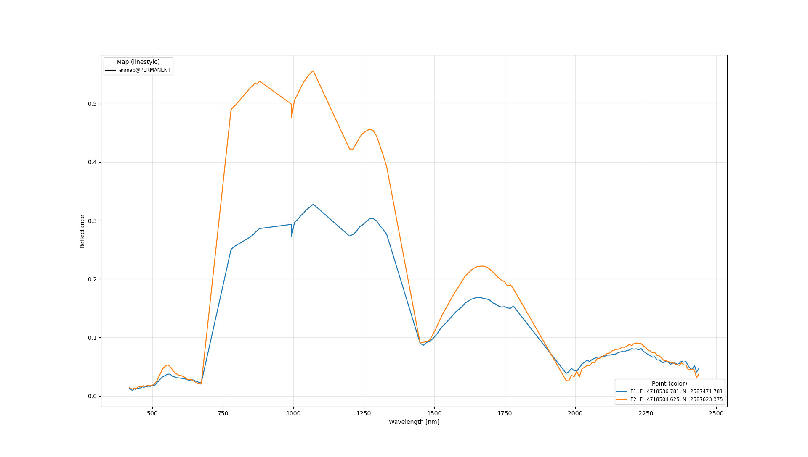
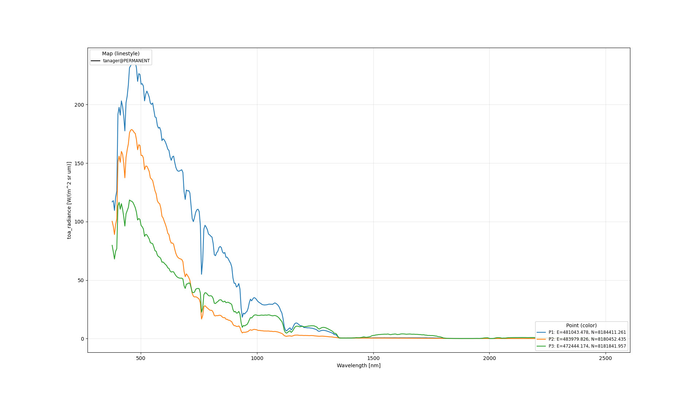

## DESCRIPTION

*i.hyper.explore* visualizes spectra extracted from hyperspectral 3D
raster maps (`raster_3d`). It allows users to interactively inspect
spectral signatures at given map coordinates or from point vector maps.
The module supports multiple 3D raster maps simultaneously for
comparison (e.g., original data, preprocessed data, or reduced
components).

Each queried location is sampled across all spectral bands using
`r3.what`. The resulting spectral curves are plotted or printed in JSON
format (with the **-p** flag). If an output file is specified
(`output=`), the figure is exported instead of being shown
interactively.

*i.hyper.explore* automatically reads wavelength metadata, measurement
type (e.g., *reflectance*, *radiance*), and units from `r3.info`
comments produced by [i.hyper.import](i.hyper.import.html) or
[i.hyper.preproc](i.hyper.preproc.html). If the map contains principal
components or other dimensionally reduced features, the module detects
this and adjusts the X-axis to component indices.

## FUNCTIONALITY

-   Query spectra from one or more 3D raster maps at arbitrary
    locations.
-   Plot spectral curves for all queried points, automatically handling
    units and wavelength axes.
-   Detects whether the data represent reflectance, radiance, or
    dimensional components from metadata.
-   Export plots to `.png`, `.pdf`, or `.svg` via `output=`.
-   Optionally output structured JSON data for external analysis with
    the **-p** flag.
-   Automatically labels plots based on measurement type, units, and
    number of components.
-   Supports coordinate pairs (`coordinates=`) and vector point maps
    (`points=`).

## NOTES

-   Each band's wavelength and FWHM must be stored as comments in
    `r3.info` (automatically handled by *i.hyper.import*).
-   The module uses `r3.what` to extract band values at each 2D
    location.
-   If the raster represents dimensional components (e.g., PCA, NMF),
    the plot's X-axis switches to "Components".
-   The output plot resolution can be set with `dpi=`.
-   Line width and font size can be scaled with `style_scale=` (default:
    1.0).
-   Line colors correspond to query points; linestyles correspond to
    input maps.
-   Interactive plots support renaming legends and saving figures
    directly from the viewer.

## EXAMPLES

::: code
    # Example 1: Compare spectra from EnMAP 3D raster map at two locations
    i.hyper.explore map=enmap@PERMANENT \
                    coordinates=4718536.78125,2587471.78125,4718504.625,2587623.375
:::

::: {align="center" style="margin: 10px"}
{width="640" height="480"
border="0"}\
*Figure: Reflectance spectra plots generated with i.hyper.explore*\
[*Data source: Copyright © 2012--2025 EnMAP at Earth Observation Center
EOC of DLR.*]{.small}
:::

::: code
    # Example 2: Explore multiple spectra from Tanager 3D raster map
    i.hyper.explore map=tanager@PERMANENT \
                    coordinates=481043.478,8184411.261,483979.826,8180452.435,472444.174,8181841.957
:::

::: {align="center" style="margin: 10px"}
{width="640" height="480"
border="0"}\
*Figure: Radiance spectra plots generated with i.hyper.explore*\
[*Data source: Planet Labs -- Open Data, CC-BY-4.0.*]{.small}
:::

## DEPENDENCIES

-   **GRASS** module: `r3.what`

## AUTHORS

Tomaž Žagar and Alen Mangafić, Geodetic Institute of Slovenia
